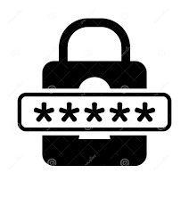

# 🔐 PasswordVault 2.0

<div align="center">



**Your Digital Fort Knox for Password Security**

*Secure • Simple • Sophisticated*

[](https://python.org)
[](LICENSE)
[](#security)
[](#interface)

</div>

---

## 🌟 **What is PasswordVault?**

PasswordVault is a **desktop fortress** for your digital credentials. In an era where cyber threats lurk around every corner, PasswordVault stands as your personal guardian, ensuring that your usernames, passwords, and sensitive information remain **encrypted, organized, and accessible only to you**.

> *"Your passwords deserve a vault, not a sticky note."*

---

## ✨ **Key Features**

### 🛡️ **Military-Grade Security**
- **SHA-256 Encryption** with cryptographically secure salt generation
- **Zero-Knowledge Architecture** - We never see your data
- **Secure Password Hashing** using industry best practices
- **Input Sanitization** to prevent injection attacks

### 🎨 **Intuitive User Experience**
- **Modern GUI** built with Tkinter
- **Real-time Password Strength Indicator**
- **Smart Form Validation** with instant feedback
- **Responsive Design** that adapts to your workflow

### 🔧 **Robust Architecture**
- **Modular Design** for easy maintenance and updates
- **Comprehensive Error Handling** with detailed logging
- **Type-Safe Code** with full type annotations
- **Backward Compatibility** with legacy systems

### 📊 **Advanced User Management**
- **Secure User Registration** with email validation
- **Profile Management** with update capabilities
- **Soft Delete** functionality for account deactivation
- **Session Management** with secure authentication

---

## 🚀 **Quick Start Guide**

### Prerequisites
```bash
Python 3.8 or higher
```

### Installation
```bash
# Clone the repository
git clone https://github.com/rahulkpareek/passwordvault.git

# Navigate to the project directory
cd passwordvault

# Install required dependencies
pip install -r requirements.txt

# Launch PasswordVault
python MainScreen.py
```

### First Run
1. **Launch** the application
2. **Register** your master account
3. **Sign in** securely
4. **Start** managing your passwords!

---

## 🏗️ **Architecture Overview**

```
PasswordVault/
├── 🎯 MainScreen.py          # Main application interface
├── 📝 RegisterScreen.py      # User registration interface  
├── 🔐 SignIn.py             # Authentication logic
├── 📋 SignUp.py             # User registration logic
├── 🎛️ Handlers.py           # Event handlers & validation
├── 🗄️ DBhelper.py           # Database operations
├── 📊 Logo.png              # Application branding
└── 📖 README.md             # You are here!
```

---

## 🔧 **Core Modules**

### 🗃️ **Database Layer** (`DBhelper.py`)
- **TinyDB Integration** for lightweight, file-based storage
- **CRUD Operations** with comprehensive error handling
- **Query Builder** for complex data retrieval
- **Connection Management** with automatic cleanup

### 🔒 **Authentication Engine** (`SignIn.py`)
- **Secure Login** with salt-based password hashing
- **Session Management** with user state tracking
- **Password Change** functionality
- **User Information** retrieval and display

### 👤 **User Management** (`SignUp.py`)
- **Registration Workflow** with comprehensive validation
- **Email Verification** with format checking
- **Password Strength** enforcement
- **Profile Management** with update capabilities

### 🎮 **Event Handling** (`Handlers.py`)
- **Input Validation** with real-time feedback
- **Error Management** with user-friendly messages
- **Logging System** for debugging and monitoring
- **Callback Management** for UI interactions

---

## 🛡️ **Security Features**

### 🔐 **Encryption Standards**
```python
# Password Hashing Example
salt = secrets.token_hex(32)  # Cryptographically secure salt
password_hash = hashlib.sha256((password + salt).encode()).hexdigest()
```

### 🛠️ **Security Measures**
- ✅ **Salt-based Password Hashing**
- ✅ **Input Sanitization & Validation**
- ✅ **SQL Injection Prevention**
- ✅ **Secure Random Generation**
- ✅ **Error Handling Without Information Leakage**
- ✅ **Logging for Security Monitoring**

---

## 🎨 **User Interface**

### 🖥️ **Main Login Screen**
- Clean, professional design
- Real-time input validation
- Secure password masking
- Quick registration access

### 📝 **Registration Interface**
- Step-by-step user guidance
- Password strength indicator
- Email format validation
- Instant feedback system

### 🎛️ **User Dashboard**
- Secure information display
- Profile management options
- Password change functionality
- Session management

---

## 📚 **Dependencies**

| Module | Purpose | Version |
|--------|---------|---------|
| **TinyDB** | Lightweight JSON database | Latest |
| **Hashlib** | Cryptographic hashing | Built-in |
| **Secrets** | Secure random generation | Built-in |
| **Tkinter** | GUI framework | Built-in |
| **Re** | Regular expressions | Built-in |
| **Logging** | Application logging | Built-in |

---

## 🔄 **Development Roadmap**

### 🎯 **Version 2.1** (Coming Soon)
- [ ] **Multi-factor Authentication**
- [ ] **Password Generator** with customizable rules
- [ ] **Import/Export** functionality
- [ ] **Dark Mode** theme support

### 🚀 **Version 3.0** (Future)
- [ ] **Cloud Synchronization**
- [ ] **Mobile Companion App**
- [ ] **Browser Extension**
- [ ] **Biometric Authentication**

---

## 🤝 **Contributing**

We welcome contributions from the community! Here's how you can help:

### 🐛 **Bug Reports**
Found a bug? Please create an issue with:
- Detailed description
- Steps to reproduce
- Expected vs actual behavior
- System information

### 💡 **Feature Requests**
Have an idea? We'd love to hear it:
- Clear feature description
- Use case scenarios
- Implementation suggestions

### 🔧 **Code Contributions**
Ready to code? Follow these steps:
1. Fork the repository
2. Create a feature branch
3. Make your changes
4. Add tests if applicable
5. Submit a pull request

---

## 📄 **License**

This project is licensed under the **GNU GENERAL PUBLIC LICENSE** - see the [LICENSE](LICENSE) file for details.

---

## 🙏 **Acknowledgments**

### 💝 **Special Thanks**
- **TinyDB Team** for the excellent lightweight database
- **Python Community** for the robust standard library
- **Security Researchers** for best practices guidance
- **Beta Testers** for valuable feedback

### 🌟 **Contributors**
*A heartfelt thank you to all our contributors who make PasswordVault better every day!*

<div align="center">

---

**Made with ❤️ for Digital Security**

*PasswordVault - Where Your Secrets Stay Secret*

[⭐ Star us on GitHub](https://github.com/rahulkpareek/passwordvault) | [🐛 Report Issues](https://github.com/rahulkpareek/passwordvault/issues) | [💬 Join Discussion](https://github.com/rahulkpareek/passwordvault/discussions)

</div>

---

## 📞 **Support & Contact**

- **Documentation**: [Wiki](https://github.com/rahulkpareek/passwordvault/wiki)
- **Issues**: [GitHub Issues](https://github.com/rahulkpareek/passwordvault/issues)
- **Discussions**: [GitHub Discussions](https://github.com/rahulkpareek/passwordvault/discussions)
- **Email**: 

---

<div align="center">

*"In cryptography we trust, in PasswordVault we secure."*

**Version 2.0** | **Last Updated**: December 2024

</div>
